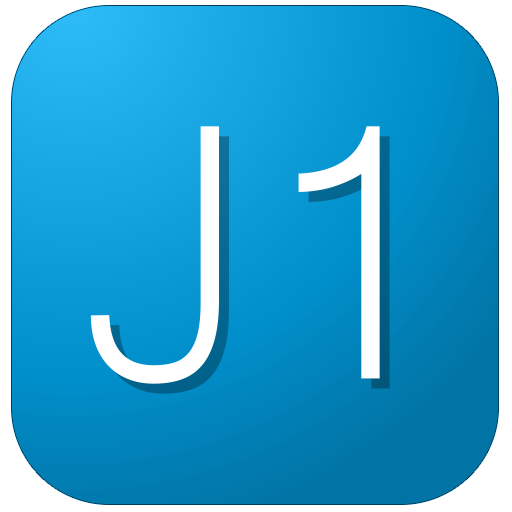

## O Guia de Utilização

Este documento tem como objectivo disponibilizar informação útil para quem necessita de conhecer, e dar a conhecer, o **jOne**.

Após consulta e navegação pelo documento será possível:

* dominar, no contexto técnico, as ferramentas disponibilizadas no **jOne**;
* responder a questões colocadas por outros utilizadores, e orientá-los de forma a sua utilização seja natural e fluida;
* ser capaz de realizar a manutenção exigida pelo sistema.

Caso haja problemas na utilização da aplicação, será possível:

1. enviar email para [uds@chsj.min-saude.pt](mailto:uds@chsj.min-saude.pt) obrigatoriamente em qualquer chamada com a exposição do problema ou sugestão.
+ nos dia úteis (das 9h às 18h) ligar para o número 963887146. Caso não atenda ligar para o número do responsável 964884656

